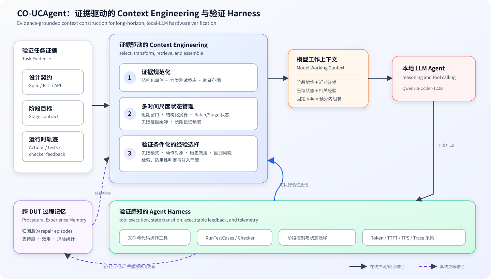

# LCO-UCAgent：面向私有化大模型芯片验证的证据驱动 Agent Harness

**LCO-UCAgent** 全称为 **Local-LLM Context-Optimized UCAgent**，表示一套面向私有化
部署大语言模型的芯片验证 Agent Harness。名称中的 `Local-LLM` 强调推理服务、任务状态、
工具反馈和验证轨迹由使用者或组织控制，而不是把“本地模型”划分为一种独立模型类别。
LCO-UCAgent 在模型之外组织状态、工具、验证、记忆和运行时控制，并将上下文管理作为
Harness 的一个核心子系统，在模型参数保持不变的条件下提高长时验证任务的执行效率与
证据可靠性。为兼容现有发布入口，GitHub 仓库名 `CO-UCAgent` 与命令行入口
`co-ucagent` 暂时保持不变。

[](LICENSE)
[](pyproject.toml)
[](CHANGELOG.md)
[](https://github.com/XS-MLVP/UCAgent)

**项目入口：** [快速开始](#快速开始) · [七项开源工具](#4-open-source-toolkit) ·
[工具命令手册](TOOLKIT.md) · [实验结果](#6-results) ·
[复现说明](#9-artifact-and-reproducibility)

## 摘要

大语言模型 Agent 正在被用于规范理解、验证环境构建、测试生成和缺陷归因。与单轮代码
生成不同，完整芯片验证会持续数小时，并在规范、RTL、测试、覆盖率和 Checker 反馈之间
形成不断增长的异构上下文。私有化部署进一步放大了这一问题：有限的推理吞吐使重复预填充
和无效修复具有较高代价，而测试未执行、基础设施异常和验证范围变化又会使错误经验进入
摘要或长期记忆。现有上下文压缩与相似度检索难以同时保证信息效率、证据可靠性和跨任务
适用性。

本文提出 LCO-UCAgent（Local-LLM Context-Optimized UCAgent），一个面向私有化大模型
芯片验证的 verification-aware agent harness。
其核心方法由可执行验证反馈驱动。Harness 将代码修改、测试执行、Checker 反馈和阶段
迁移规范化为具有来源的结构化证据，并在每次模型调用前从阶段契约、近期交互、层次化
状态和长期记忆中构造工作上下文。对于跨任务经验，LCO-UCAgent 从轨迹中提取修复片段
（repair episode），根据失败集合变化、阶段推进、诊断信息和回归风险评估其作用，仅在
历史行动与当前失败具有可验证适用性时将其用于后续推理。该设计将 Prompt、memory、
tool feedback、状态维护与执行控制纳入同一个可审计 Harness 闭环。

同 seed 的 clean Adder 实验中，LCO-UCAgent 将 30-Stage active time 从 12h59min 降至
5h37min（-56.7%），Checker 失败事件由 70 次降至 41 次；HPerfCounter 的运行
耗时下降 27.0%，Prompt token 下降 37.4%。FSM、ShiftRegister 和 Mux 的实验结果分别观察到 67.8%、68.5% 和 59.0% 的 active-time 降幅。验证差分归因在两个包含
40 条样本的人工标注集上均取得 0.80 accuracy，经验适用性过滤使历史回放中的 Prompt
条目减少 50.6%。ALU754 的 checkpoint-composed 完成链仍高于 baseline，说明现有机制
已经在部分 DUT 上形成明显收益，但跨 DUT 稳定性仍需通过更多重复实验验证。

**关键词：** 芯片验证智能体；私有化大模型部署；Agent Harness；过程记忆；验证反馈；
长时智能体

## 快速开始

LCO-UCAgent 支持任意 OpenAI-compatible 对话模型服务。芯片仿真示例还需要 Python 3.11、
Verilator、C++ 工具链和 [Picker](https://github.com/XS-MLVP/picker)；Dockerfile 基于
Picker 官方镜像，适合希望复用完整验证环境的用户。

```bash
git clone https://github.com/spadenoheart/CO-UCAgent.git
cd CO-UCAgent

python3.11 -m venv .venv
source .venv/bin/activate
python -m pip install --upgrade pip
python -m pip install -e .
```

配置组织内模型服务。下面以 Ollama 的 OpenAI-compatible 接口为例，模型名称可以替换为服务端
实际提供的模型：

```bash
export OPENAI_MODEL='mdq100/qwen3.5-coder:122b-64k'
export OPENAI_API_KEY='ollama'
export OPENAI_API_BASE='http://127.0.0.1:11434/v1'
```

运行仓库内的 Adder 示例。`run_Adder` 是无交互、可记录日志的公开运行入口；
`test_Adder` 启动 TUI 与人工交互模式。

```bash
make run_Adder
# 或：make test_Adder
```

也可以绕过 Makefile，直接使用安装后的 CLI：

```bash
make init_Adder CWD=output/adder_demo
co-ucagent output/adder_demo Adder --config config.yaml \
  --interaction-mode standard --loop --exit-on-completion --stream-output
```

安装会同时提供七项研究工具。以下命令可查看稳定子命令；完整示例见
[TOOLKIT.md](TOOLKIT.md)。

```bash
co-llm-profiler --help
co-context --help
co-memory-cache --help
co-trace --help
co-strategy --help
co-bench --help
co-trajectory-data --help
```

## 1. Motivation

### 1.1 私有化部署的大模型及其系统形态

私有化部署的大模型，是指模型权重或推理服务运行在个人、实验室或企业能够直接管理的
计算环境中。其实现形态可以是工作站上的单机推理、实验室多 GPU 服务器，也可以是企业
数据中心内的推理集群。该概念描述的是模型能力的部署与治理方式，与模型参数规模、是否
量化以及是否采用标准 API 无直接对应关系：百亿或千亿参数模型同样可以通过量化和多卡
并行部署，并以 OpenAI-compatible 接口向上层应用提供服务。

开放权重模型和推理运行时的发展，使这种部署方式逐渐形成完整的软件基础设施。
[llama.cpp](https://github.com/ggml-org/llama.cpp) 支持模型在 CPU、GPU 及多种硬件后端运行，
[Ollama](https://github.com/ollama/ollama) 管理模型获取、加载和服务生命周期，
[LocalAI](https://github.com/mudler/LocalAI) 以兼容接口统一不同推理后端。这些项目共同使
模型版本、量化格式、上下文上限、采样参数、硬件分配和运行日志进入使用者可配置、可观测
和可复现的范围。私有化部署由此成为一种可治理的模型运行环境，而不仅是把推理程序安装在
某台本地计算机上。

模型运行环境之上还需要面向任务的应用与执行系统。[PrivateGPT](https://github.com/zylon-ai/private-gpt)
展示了私有数据接入、检索和生成服务如何建立在私有化推理组件之上；代码与科研 Agent 则还
需要文件操作、工具调用、状态持久化、错误恢复和外部验证。LCO-UCAgent 位于这一 Agent
Harness 层，负责连接私有化部署的大模型、芯片设计资产、仿真测试工具与多阶段验证状态，
将通用生成能力组织为能够持续执行和接受验证反馈的工程流程。

项目名称中的 `Local-LLM` 因而指向上述私有化部署前提。本文在技术叙述中统一使用
“私有化部署的大模型”和“组织内推理服务”，并将研究重点放在模型之上的 Harness：当模型
参数和推理资源受到既定条件约束时，执行系统如何提高其完成长时芯片验证任务的效率、
稳定性与可审计性。

### 1.2 私有化部署为何是芯片验证的基础条件

芯片验证的工作负载同时涉及高价值设计资产、持续数小时的模型调用、内部 EDA 环境以及
严格的结果追溯，模型的运行位置、数据边界和资源配置因而成为验证系统设计的一部分。
私有化部署的价值由以下四项需求共同构成。

**设计资产需要连续的数据边界。** 芯片验证向模型暴露的内容远多于一段孤立代码。一个
完整轨迹会逐步包含微架构规范、RTL 端口、验证 API、内部脚本、波形或仿真输出、缺陷位置
和尚未公开的修复建议。即使初始 Prompt 已脱敏，后续工具返回仍可能重新带入模块层级、
信号命名和失败条件。LLM 隐私研究系统总结了训练数据泄漏、推理输入暴露和应用链路攻击
等风险（[Miranda et al., 2024](https://arxiv.org/abs/2408.05212)）。
[ChipNeMo](https://arxiv.org/abs/2311.00176) 的工业实践也显示，芯片领域能力高度依赖专有
代码、文档和 bug 数据。将模型服务与 Harness 部署在组织治理边界内，能够减少设计资产
经过外部服务的环节，并让访问控制、日志保留和数据清理服从现有研发制度。它不能自动
消除内部越权、Prompt injection 或模型输出泄密，但为这些治理措施提供了可实施边界。

**长时 Agent 需要可规划的推理供给。** 单轮问答的主要成本来自一次 Prompt 和一次生成，
验证 Agent 则会在每次文件读取、测试和 Checker 调用后再次请求模型。系统指令、工具
schema、设计契约与历史观察因此被反复预填充，最终输入规模可能比输出高出多个数量级。
[FrugalGPT](https://arxiv.org/abs/2305.05176) 证明模型路由和请求策略会显著改变 API 成本；
在长时验证中，重复实验和多 seed 还会继续放大这一差异。组织内推理把逐请求费用转化为
硬件占用、能耗和运维成本，使团队能够固定计算预算、控制并发并持续采集细粒度遥测。只有
当设备利用率、维护成本和任务规模达到合适区间时，这种模式才具有经济优势，因此 LCO-UCAgent
关注的目标不是宣称私有化推理天然便宜，而是提高既定推理资源产生有效验证进展的效率。

**验证研究依赖稳定且可审计的模型环境。** Agent 策略实验需要区分模型变化与 Harness
变化。托管服务可能调整模型版本、系统策略、上下文实现或限流方式，即使 API 名称保持
不变，也可能改变行为分布。组织内推理允许冻结权重、量化格式、上下文上限、采样参数、
服务引擎和 GPU 拓扑，并保存每次调用的精确输入、输出与时间指标。这样才能在相同 seed、
相同 DUT 和相同 checkpoint 上开展成对回放，定位收益究竟来自模型、推理系统还是 Harness
策略。对于企业验证，完整证据链还支持失败复盘、责任边界和版本审计，避免将一次不可解释
的成功直接作为可复用结论。

**私有数据需要形成组织内能力闭环。** 芯片设计语言、接口约定、Checker 规则和缺陷模式
都具有明显的组织特征。ChipNeMo 表明，领域预训练、指令对齐与领域检索能够让模型在工程
问答、EDA 脚本和 bug 总结等任务上获得显著收益。对验证 Agent 而言，价值还来自执行后
产生的轨迹：哪些修改被测试证实、哪些诊断缩小了问题、哪些操作造成回归。私有化部署使
这些数据可以在内部经过脱敏、归因和质量筛选后用于检索、LoRA 或策略学习，从而建立
“执行、验证、积累、再利用”的长期闭环，而无需把原始 RTL 与内部缺陷记录移出组织。

### 1.3 私有化推理环境下的长时验证 Agent 挑战

组织内推理解决了数据和运行控制权问题，却不会自动产生可靠 Agent。模型能力必须通过
Harness 的观察、状态、控制、行动和验证机制转化为连续任务行为。芯片验证轨迹暴露出四个
相互耦合、同时可以由 Harness 直接干预的系统挑战。

**C1：有限推理预算会被无进展循环持续放大。** 私有化部署通常以固定 GPU 数量服务一个
大模型。权重加载、量化、多卡切分和 KV cache 已占用大部分资源，Agent 请求又具有长
Prompt、低并发和强串行依赖等特征。[LLM in a Flash](https://arxiv.org/abs/2312.11514)、
[FlexGen](https://arxiv.org/abs/2303.06865)、[PowerInfer](https://arxiv.org/abs/2312.12456)
和 [AWQ](https://arxiv.org/abs/2306.00978) 分别从存储分层、张量调度、稀疏激活和低比特
量化降低单次推理成本，但这些优化无法判断一次模型调用是否推动了验证任务。如果 Harness
在相同 Checker 失败下继续允许近似修改、全量测试和再次推理，TTFT、decode 与测试时间会
按循环次数累积。最终瓶颈表现为“模型一直在工作但阶段没有推进”，而非单一 TPS 指标偏低。

**C2：持续演化的执行状态难以压缩为一个可靠 Prompt。** 验证流程同时维护长期稳定的
RTL/API 契约、阶段级完成条件、近期失败集合、当前修改差分和跨任务经验。这些状态具有
不同生命周期和可信度。完整保留对话会重复预填充大量过期日志，并让关键失败被历史内容
稀释；按 token 截断可能删除仍然有效的端口或 schema；自由文本摘要则可能合并冲突观察
或丢失精确标识符。PagedAttention、StreamingLLM 和 SnapKV 能改善 KV cache 与长序列
执行效率，但 [Lost in the Middle](https://doi.org/10.1162/tacl_a_00638) 和
[RULER](https://arxiv.org/abs/2404.06654) 表明，更长窗口并不等价于更可靠的信息使用。
因此，挑战不只是让更多文本进入模型，而是由 Harness 判断哪些状态仍然有效、如何表达其
来源，以及哪一部分应参与当前决策。

**C3：工具返回不能直接视为可信验证证据。** 长时 Agent 的环境观察来自文件系统、pytest、
仿真器、Checker 和阶段管理器，其语义并不统一。`tests_total=0`、collection error、timeout、
crash 和真正的断言失败可能具有相似日志外观；局部测试通过也不能证明阶段契约已经满足。
如果 Harness 仅把 stdout 拼回对话，模型可能把“命令执行结束”理解成“验证成功”，随后
推进阶段、改写 bug 文档或把该行动写入记忆。[INFERCEPT](https://arxiv.org/abs/2402.01869)
与 [Prompt Cache](https://arxiv.org/abs/2311.04934) 关注工具中断后的计算复用，但并不负责
判定观察是否有效。通用反思方法同样通常假设环境反馈已经可用。芯片验证需要额外的反馈
契约，把执行状态、测试范围、失败集合和 Checker 结论转化为模型与控制器均可消费的证据。

**C4：历史轨迹缺少局部信用与迁移边界。** 一条最终成功的轨迹往往混合规范阅读、错误
尝试、诊断测试、回退和真正修复。按终局成功给整条轨迹赋正信用，会把无效或有害行动一并
保存；按语义相似度检索，又可能把相似 Checker 文本下的不同根因混合。例如同样的“检查点
未覆盖”可能来自测试未执行、标签拼写、API 驱动错误或 DUT 行为异常，其正确修改对象并不
相同。Reflexion、ExpeL、A-MEM 和 Mem0 已证明反思、经验提取和结构化记忆的价值，但其
主要指标集中于记忆召回或最终任务表现，难以直接回答某个 HDL 修复是否减少失败、推动阶段
且没有引入回归。跨 DUT 复用若缺少这一边界，记忆越丰富，negative transfer 的机会也可能
越多。

### 1.4 LCO-UCAgent 的 Harness 响应

近期 Harness 研究将 Agent 描述为基础模型与执行系统的组合，并将 Harness 分解为 observation、
context、control、action、state 和 verification 等相互依赖的职责
（[Guo et al., 2026](https://arxiv.org/abs/2606.20683)）。LCO-UCAgent 延续这一系统视角，
把上下文构造放回 Harness 内部，与工具协议、状态持久化、验证门控和循环控制共同设计。
其四组机制分别对应前述 C1–C4。

**H1：预算与进展联合控制。** Harness 在 request 和 stage 两个层级记录 Prompt
token、TTFT、decode、工具时间、Checker 签名和阶段推进。进展控制器不以“模型产生了新
文本”或“某个局部测试通过”作为清零条件，而是比较失败集合、Checker 状态和阶段转换。
当同一失败签名持续出现时，控制器触发策略 pivot；当同一决策区间的修改次数超过预算时，
工具层可以拒绝继续无差异 mutation。该机制不能提高模型本身的 TPS，但能阻止低收益调用
无限累积，并把推理成本与任务进展放在同一观测空间中。

**H2：类型化状态基座与阶段化输入编译。** Harness 将原始对话拆分为稳定契约、
Stage/Batch 状态、近期失败、修改摘要、验证证据和候选经验。阶段状态包显式保存当前任务、
允许修改对象、尚未满足的 Checker 条件和剩余预算；observation masking 隐藏已经失效的
重复日志，同时保留最新失败和不可丢失的接口标识。结构化摘要、层次化摘要、近期窗口和
阶段预取分别服务于不同时间尺度。这里的上下文管理是一项运行时编译过程，其目标是从
Harness 状态生成当前行动所需的最小充分输入，而不是独立于执行状态压缩一段聊天记录。

**H3：验证器驱动的反馈契约。** 工具层将测试结果规范化为 `pass`、
`test_failure`、`infrastructure_error`、`timeout`、`crash` 和 `no_tests_collected` 六类
互斥终态，并把代码修改、测试范围、Checker 反馈和阶段转换记录为结构化事件。只有实际
执行且范围可比较的验证结果才能形成正向证据；无测试、基础设施错误和异常退出均不能被
汇总为成功。阶段契约进一步约束允许修改的文件、bug 文档 schema 和完成条件，使语言模型
判断与确定性控制逻辑共享同一事实来源，也为后续记忆归因提供可信观察。

**H4：验证条件化的轨迹记忆与风险门控。** Harness 将轨迹切分为具有
`failure_before`、`action_sequence` 和 `observation_after` 的 repair episode，并根据失败
集合变化、阶段推进、信息增益、动作成本和回归数量标记 `progress`、`diagnostic`、
`no_progress`、`regression` 或 `invalid`。检索阶段在语义相关性之外检查失败类型、阶段职责、
修改对象、历史支持度和风险；高风险策略需在冻结 checkpoint 上进行注入/不注入成对回放，
只有真实 Checker 收益为正且未引入回归时才具备入库依据。这一流程把“记住相似经验”转换
为“复用经过验证且适用于当前状态的行动证据”。

| 挑战 | Harness 响应 | 主要可观测量 |
|---|---|---|
| C1 推理预算被无进展循环放大 | H1 进展控制、pivot、修改预算和成本遥测 | stage wall time、Prompt token、重复失败签名、有效推进率 |
| C2 执行状态超出单一 Prompt 的可靠承载范围 | H2 阶段状态包、多时间尺度状态与 observation masking | 输入 token、状态覆盖率、摘要触发、Checker 条件保留率 |
| C3 工具返回缺乏统一可信语义 | H3 六类测试终态、结构化事件与阶段契约 | invalid rate、测试范围、Checker 收益、错误分类 |
| C4 成功轨迹存在信用混淆和跨 DUT 负迁移 | H4 episode 归因、适用性门控与成对回放 | progress/regression、注入收益、negative transfer、action cost |

LCO-UCAgent 因而优化的是完整 Harness 将模型能力转化为可验证进展的效率。上下文管理仍然
重要，但它与观察规范化、状态维护、工具治理、循环控制和验证门控共同决定最终行为，不能
单独代表整个系统。

### 1.5 研究命题与可证伪问题

现有 Harness 与 Agent memory 工作已经说明，模型外的执行系统和历史经验能够改变任务表现；尚不充分的是这些改变能否被归因于可靠的中间状态，
以及它们在跨任务迁移时能否持续产生正收益。芯片验证提供了测试、Checker 和阶段迁移等外部信号，使这一问题能够从最终成功率分析下沉到具体行动转移。

因此本文的中心假设是：**在模型、硬件、任务和执行预算保持一致时，以验证状态为条件选择控制
动作与历史经验，可以提高单位推理成本产生的有效进展，并且不增加回归与无效验证。** 这里
的“有效进展”由失败集合减少、Checker 条件满足或阶段推进定义；“推理成本”同时包括 Prompt
token、模型请求和 wall time；回归与无效验证作为独立风险结果保留，不能被平均耗时下降
掩盖。

为检验这一假设，实验以一次可比较的 **状态—行动—观察转移** 为基本分析单元。状态包含
当前失败、验证范围、阶段契约和已确认修改；行动包括模型决策、工具使用和经验注入；观察
由后续测试、Checker 或阶段迁移给出。局部研究在冻结 checkpoint、相同 seed 和相同输入
条件下进行注入/不注入或控制器关闭/开启的成对回放，完整 DUT 实验则检验局部收益能否累积
为完成率、时间和 token 的端到端改善。该设计区分了系统检索到的相关内容与检索实际改变
的验证结果。

本文据此回答三个可证伪问题：

- **RQ1：局部有效性。** 验证状态条件化的 Harness 干预，相比无干预和仅按语义相似度选择经验，
是否提高失败净减少量与阶段推进率，并降低达到相同 Checker 结果所需的 token 和时间？

- **RQ2：迁移可靠性。** 在 held-out DUT 上，历史轨迹能否保持正向 Checker 收益，同时不提高 regression、
invalid 和 negative-transfer rate？若收益只存在于同 DUT 或相同错误文本中，则跨 DUT 策略库的泛化假设不成立。

- **RQ3：端到端效应。** 局部控制收益能否在完整验证链中转化为更高完成率或更低总成本，
  并在多个随机种子上保持方向一致？若局部指标改善但完整运行没有收益，则方法应被限定为诊断与过程治理工具，
  而不能宣称提升 Agent 整体性能。

上述命题也明确了方法边界。Harness 可以减少状态丢失、无效循环和错误经验迁移，但不能补足基础模型尚未具备的 RTL 推理能力，也不能以内部 Checker 通过替代独立功能正确性。
因此，本文在结论部分同时报告完成了状态、外部缺陷证据、成本、回归和无效运行。
## 2. Contributions

本项目作出以下贡献：

1. **提出面向私有化大模型芯片验证的证据驱动 Agent Harness。** LCO-UCAgent 将观察
   规范化、状态维护、输入编译、工具治理、阶段控制和验证门控组织为统一执行闭环，使模型
   行动始终关联到可审计的任务状态与外部验证结果。
2. **设计类型化、多时间尺度的验证状态基座。** 结构化事件和六类测试终态提供统一事实
   来源；稳定契约、Stage/Batch 状态、近期失败、修改摘要和 observation masking 按不同
   生命周期维护模型决策所需信息。
3. **提出验证器条件化的跨 DUT 轨迹记忆。** 系统依据前后验证差分对 repair episode 进行
   角色化归因，并联合失败签名、阶段职责、修改对象、跨任务支持、历史效用与回归风险判断
   经验的适用范围。
4. **建立 Harness 级的评测与复现基础。** 指标体系同时覆盖任务完成、推理成本、行动质量、
   归因准确率和记忆污染；配套工具支持精确模型输入记录、性能采集、checkpoint 成对回放、
   运行类型标注与实验配置冻结。

## 3. System Design

### 3.1 框架概述

LCO-UCAgent 将语言模型与其运行基础设施明确分离。模型负责基于当前输入进行推理并选择
工具；Agent Harness 负责维护任务状态、暴露文件与验证工具、执行阶段转换、构造每轮
模型输入并记录运行证据。LCO-UCAgent 在保持模型参数不变的条件下扩展 Harness，因此
同一套方法可以作用于不同规模、量化方式或服务后端的私有化模型。

<p align="center">
  
  <br>
  <strong>图 1：LCO-UCAgent 的系统架构。</strong>实线表示在线的上下文构建与验证闭环，
  虚线表示运行后的经验归因、过程记忆更新与后续检索。
</p>

图 1 左侧给出三类原始证据。设计契约描述 DUT 规范、RTL 端口和验证 API；阶段目标规定
当前步骤允许修改的对象与完成条件；运行时轨迹保存模型行动及测试、Checker 返回的环境
观察。Harness 内部的状态与输入编译器不会直接拼接这些原始内容，而是依次完成证据规范化、
多时间尺度状态维护和验证条件化的经验选择，最终在给定 token 预算内形成模型工作上下文。
模型据此生成工具调用，Harness 执行修改或验证，并把新的可执行结果写回状态基座，形成
在线闭环。

图中的跨 DUT 过程记忆位于在线循环之外。一次运行结束后，系统把“失败观察—行动序列—
后续验证”切分为可审计的修复片段，并根据验证差分评估其作用。通过质量筛选的片段被合并
到过程记忆；后续运行只有在失败语义、阶段职责和修改对象均匹配时才会检索这些经验。因而，
该模块区别于保存用户事实或对话片段的通用记忆，更接近由验证器反馈监督的 procedural
memory。

在该架构中，**Agent Harness 是上层研究对象**：它规定模型能够观察什么、可以执行什么、
环境如何反馈、状态如何持久化以及何时允许任务推进。上下文构造属于其中的状态呈现机制，
负责把 Harness 已确认的事实编译成一次模型调用可消费的输入；它与工具协议、循环控制和
验证器共同工作，而不是一条独立于执行系统的优化链。

### 3.2 验证感知的结构化事件

Harness 决策的可靠性首先取决于输入证据是否可信。自然语言运行日志通常混合
模型解释、工具输出和控制信息，难以判断某段文本对应哪一次修改，也无法区分功能失败与
测试进程异常。LCO-UCAgent 因此在 Harness 内建立独立的事件流，将行动和观察记录到
`structured_events.jsonl`。每条事件包含 DUT、线程、模型轮次、阶段编号、时间戳和事件
类型，并使用这些字段恢复局部的行动—观察关系。

事件模型覆盖三类对象。`file_mutation` 描述写入、追加、局部替换、复制、移动和删除等
操作，记录目标路径、文件类别、修改规模与内容摘要，而不在事件流中重复保存完整代码。
`test_run` 和 `check_result` 描述测试或 Checker 实际验证了什么，包括测试选择范围、
通过与失败集合、错误类别、阻塞项和执行耗时。`stage_transition` 则记录阶段是否推进，
防止把“测试数量下降”与“工作流目标完成”混为同一种进展信号。

原始工具返回在进入事件流之前经过结果归一化。测试终态被划分为六个互斥类别：

**表 1：测试执行结果的规范化终态。**

| 终态 | 含义 |
|---|---|
| `pass` | 测试被实际收集并全部通过 |
| `test_failure` | 测试执行完成且存在断言或功能失败 |
| `infrastructure_error` | 收集、依赖或运行环境异常 |
| `timeout` | 测试在预算内未完成 |
| `crash` | 测试进程非正常退出 |
| `no_tests_collected` | 未收集到可执行测试 |

`pass` 要求至少收集并实际执行一个测试，且不存在测试失败或运行异常。其他五类结果仍然
是有意义的环境观察，但不能证明此前修改正确。例如，`infrastructure_error` 可以提示依赖
或导入问题，`no_tests_collected` 可以暴露测试发现错误；二者都不应获得成功信用。这一
区分阻止了“没有运行测试”等价于“所有测试通过”的污染路径。

连续两次验证还需要满足**验证范围可比性**。系统根据测试选择集合将前后观察标记为
`same`、`narrowed`、`expanded`、`disjoint` 或 `incompatible`。只有在相同范围内，或在
能够明确映射失败集合的范围变化下，失败数量差才具有直接意义。例如，从完整测试集切换到
单一测试得到零失败，只能说明该目标测试通过，不能推断其他失败已经被修复。结构化终态与
范围关系共同构成后续归因和记忆写入的证据基础。

### 3.3 多时间尺度状态管理与动态上下文构建

在第 $t$ 次模型调用前，Context Engine 从五类来源构造工作上下文：设计与 API 契约、
当前阶段状态、近期行动—观察窗口、跨阶段长期状态，以及与当前失败相关的过程经验。这里的
“构造”不仅是文本拼接，还包含选择、结构转换、去重、排序和预算分配。其目标是在不丢失
当前决策所需约束的前提下，减少对早期原始消息和重复工具输出的依赖。

#### 3.3.1 近期工作状态与结构化压缩

系统始终保留最近若干条模型消息和工具观察，保证模型能够看到导致当前状态的直接行动。
当历史长度超过预算时，较早消息不会被简单截断，而是转换为固定 schema 的状态摘要。
该 schema 包含 `stage_info`、`test_report`、`coverage_status`、`bug_tracking` 和 `next`
五个区域，分别保存阶段契约、最近测试统计、覆盖率缺口、缺陷证据和未完成事项。端口、
测试用例、检查点与报告路径以短引用保留，原始代码块和重复 pytest 输出则被删除。

结构化摘要的输出还经过格式与内容保护。若摘要模型返回工具调用、空内容或不完整 JSON，
Harness 会尝试规范化字段，并从最近的 Stage/Batch/Check 观察中恢复可确定的信息；无法
恢复的字段保留为空，而不是由模型补写未知事实。摘要调用使用独立的性能统计，并可配置
较小的摘要模型；当摘要模型不可用或输入超出其上下文限制时，系统回退到主模型。

#### 3.3.2 Batch、Stage 与失败状态的分层表示

单轮摘要解决消息长度问题，但不足以表达验证任务的层次结构。LCO-UCAgent 进一步维护
Batch 和 Stage 两种聚合状态。Batch 状态对应一次测试批次，保留测试总数、失败用例、
失败检查点和报告位置；Stage 状态汇总同一阶段内的多个 Batch，记录阶段完成度以及尚未
解除的阻塞项。当工作流进入新阶段时，上一阶段的低层工具输出可被 Stage 状态替代，而
接口约束和未解决失败仍然保留。

Failure-aware state 用于处理局部修复循环。系统把失败、混合结果和可信成功检查点分开
存储，并优先选择与当前阶段一致的少量条目。模型因此能够同时看到“当前仍然失败什么”、
“最近修改了什么”和“最后一个可信状态是什么”，而不会被更早的同签名错误反复占用
上下文。这个缓冲区服务于短程因果连续性，不承担跨运行知识复用。

#### 3.3.3 长期状态与阶段预取

跨阶段信息由持久化长期记忆维护。候选条目首先根据事件类型、测试状态、失败证据完整性
和写入质量计算保留分数；低于阈值的条目只进入候选记录，不直接参与 Prompt。相似条目
按内容和阶段信息合并，并通过多次支持逐步从 candidate 提升为 episode 或 semantic
memory，避免单次偶然结果立即获得较高权重。

进入阶段时，Harness 根据 DUT、阶段标题和阶段编号预取少量相关条目。检索分数综合词项
重合、可选 embedding 相似度、阶段距离、历史支持度、已观测 useful/pollution 次数和
staleness；相同阶段的检索结果使用版本化缓存，减少每轮重复搜索。预取只是候选准备，
实际写入 Prompt 仍受最低分数、相对分数和来源多样性约束。下一次验证完成后，系统根据
失败是否减少或原签名是否消失更新 useful/pollution 统计，使长期状态具有运行后反馈。

#### 3.3.4 阶段契约与最终组装

Prompt v1 为规范分组、检查点设计、Bundle/API 构建、测试实现、bug 文档和随机测试等
阶段定义各自的操作契约。阶段契约规定当前目标、允许依赖的接口、必须满足的断言与文档
schema，并把最近 Checker 阻塞项压缩为可执行的 blocker summary。这些约束属于稳定的
控制上下文，不会在每次摘要时被重新生成。

最终工作上下文按照“阶段契约与必读证据、近期行动—观察、结构化状态、相关长期状态、
修复经验”的顺序组装。每类信息具有独立数量上限和来源标签，模型能够区分当前事实与历史
类比。该过程可概括为：稳定契约用于限定行动空间，近期窗口维持局部因果，层次化状态保持
跨阶段连续性，过程经验提供可验证的修复先验。它们共同组成模型当轮可见的 working state。

### 3.4 基于验证差分的 Repair Episode 归因

语言模型 Agent 以“行动—观察”循环运行：模型修改文件或调用工具，环境返回新的测试或
Checker 结果，模型再据此决定下一步。完整 DUT 轨迹可能包含数百个循环，无法作为一个
整体直接写入记忆。LCO-UCAgent 将其中具有局部因果边界的片段定义为 **repair episode**。

一个 episode 从可信失败观察开始。例如，观察 $o_i^-$ 表示当前测试集合中 A、B 两个
用例失败；随后模型读取 API、修改测试并运行最小目标，这些连续行动构成
$a_{i:j}$；下一次有效测试结果 $o_i^+$ 表示 A 已通过而 B 仍失败。系统将这三部分记为
$e_i=(o_i^-, a_{i:j}, o_i^+)$。上标 “-” 和 “+” 分别表示行动序列之前和之后，并不
表示负样本或正样本。若后一次测试没有正常执行，$o_i^+$ 仍会被记录，但该片段不能获得
修复成功信用。

系统从这个基本转移中派生用于归因的属性。`failure_before` 保存行动前的失败签名与验证
范围；`action_sequence` 保存工具类型、修改对象和行动顺序；`observation_after` 保存
规范化测试终态及 Checker 结果。`failure_set_delta` 将失败划分为已消除、仍保留和新引入
三部分；`stage_advanced` 表示 Harness 是否确认阶段推进；`information_gain` 表示行动
是否产生新的根因、接口位置或最小复现证据；`action_cost` 近似修改规模、工具调用和验证
时间；`confidence` 则由结果完整性和前后验证范围可比性确定。

归因的目的不是评价模型生成文本的语言质量，而是回答“这段行动在验证流程中起到了什么
作用”。根据上述局部证据，每个 episode 被分配一个 credit role：

**表 2：Repair episode 的 credit role 及其记忆语义。**

| 角色 | 判定语义 | 在过程记忆中的用途 |
|---|---|---|
| `progress` | 在可比较验证范围内消除失败，或由 Harness 确认阶段完成 | 可作为候选修复经验 |
| `diagnostic` | 尚未减少失败，但定位了新的根因、接口或可复现条件 | 可作为诊断经验，不能表述为已修复 |
| `no_progress` | 核心失败集合与已知信息基本不变 | 不进入高质量过程记忆 |
| `regression` | 引入新失败、破坏既有通过项或违反新的验证契约 | 作为风险证据保留 |
| `invalid` | 测试未执行、崩溃、超时或前后范围不可比较 | 排除正向信用 |

角色判定优先使用强证据。有效阶段推进或可比较范围内的失败净减少支持 `progress`；没有
直接修复但产生新的可操作证据时判为 `diagnostic`；新增失败优先判为 `regression`；缺少
有效后验观察时判为 `invalid`。只有其余情况才进入 `no_progress`。这种局部归因避免把
最终完成 DUT 的奖励平均分配给轨迹中的每个中间行动，也为人工抽查提供了明确证据入口。

### 3.5 跨 DUT 经验抽取与风险约束检索

过程记忆的目标不是保存某个 DUT 的具体补丁，而是提取能够跨设计迁移的“失败模式—行动
类型—验证方式”关系。离线构建首先把 Checker 类别、异常文本、失败用例和失败检查点
规范化为 failure pattern，并将修改路径映射为测试代码、覆盖率代码、API/环境、规范文档
或 bug 文档等 action category。随后，系统按规范化失败签名、阶段职责和行动模式合并
相似 episode，累计其 DUT 来源、支持次数、progress/diagnostic 证据和回归记录。只有
具有有效后验观察且满足质量阈值的片段进入可检索集合；`invalid` 和低置信度片段保留用于
审计，但不会被当作正向修复经验。

在线阶段只在 `RunTestCases`、`Check` 或 `Complete` 返回当前阶段的失败后触发经验查询。
候选生成综合精确 failure pattern、阶段角色、词项重合、同 DUT 偏好、跨 DUT 支持度和
历史质量。该排序用于提高召回，但排名靠前并不意味着经验适用于当前任务。因此，系统在
候选排序之后执行 verifier-conditioned applicability filtering，其判定维度如表 3 所示。

**表 3：历史经验相对于当前失败的适用性判定。**

| 适用性维度 | 判定问题 | 对经验选择的影响 |
|---|---|---|
| Evidence readiness | 当前失败是否首先要求读取规范或建立缺失证据？ | 在证据前置条件未满足时，抑制代码修改经验 |
| Failure semantics | 历史与当前错误是否属于相同的具体契约？ | generic Checker 错误和 bug 文档子类型要求更严格的签名一致性 |
| Action-target compatibility | 历史行动修改的对象是否与当前错误来源一致？ | API、测试、覆盖率与文档经验不能仅因文本相似而互换 |
| Support and mutation risk | 该行动是否具有跨轨迹支持，且是否包含整文件写入或删除？ | 对低支持、高影响修改要求更强证据，否则降低优先级或拒绝 |
| Historical verifier utility | 该经验过去被使用后是否带来进展，是否曾产生污染？ | 提高具有稳定 useful hit 的候选分数，降低 regression、pollution 与 stale episode 的优先级 |

上述判定把“语义相关”与“行动可迁移”分开处理。例如，`reference_files_unread` 描述的
是缺失工作流证据，正确下一步是读取指定文件，而不是复用某个历史代码补丁；两个 bug
文档错误虽然都包含相似标签，却可能分别要求删除已通过用例和补全缺失 TC，其行动不能
互换。对于整文件 `write` 或 `delete_file` 等高影响操作，系统还要求更高的签名一致性和
历史支持度，从而降低跨 DUT 迁移造成大范围回归的概率。

通过适用性判定的 episode 被压缩为四部分：触发该经验的失败模式、可迁移的行动原则、
应执行的最小验证以及需要避免的风险。DUT 专有信号和值不会作为可直接复制的结论；Prompt
明确要求模型先核对当前文件。相同失败签名只注入有限次数，相同阶段/模式也具有总量限制，
防止失败循环反复追加相同经验。缺少具体行动的 compression hint 默认不能单独注入。

每次查询都会记录候选、分数分解、适用性拒绝原因、最终注入内容和下一次验证结果。若后续
失败减少或原签名消失，相关 episode 增加 useful 统计；若失败持续或出现新回归，则增加
pollution/risk 统计。该反馈不会立即改变模型权重，而是更新 Harness 后续检索、注入与
风险门控的经验选择先验。

### 3.6 性能观测与可复现实验支持

LCO-UCAgent 同时观测模型推理与 Harness 行为，避免把端到端性能变化简单归因于模型 TPS。
推理侧记录每次调用的输入/输出 token、首 token 延迟、prompt evaluation 时间、decode
时间和估计吞吐；Harness 侧记录阶段耗时、工具调用、失败循环、摘要调用、memory query、
episode injection 及其后验结果。两类指标通过模型轮次和阶段编号关联，可以区分“单次
推理变慢”“Prompt 变长”和“Agent 采取了更多无效行动”等不同原因。

精确 `llm_input_messages` dump 保存实际发送给模型的消息序列，用于把长流程中的代表性
调用重放为独立延迟测试，也支持 Prompt v0/v1 和不同 Harness 组件的受控
比较。实验冻结工具进一步保存配置、过程记忆快照和关键代码文件哈希，使一次运行能够追溯
到具体模型服务、Prompt 与检索策略。该机制既服务于性能分析，也为后续 checkpoint replay
和跨 DUT 消融提供一致输入。

## 4. Open-Source Toolkit

LCO-UCAgent Toolkit 将长时芯片验证 Agent 中反复出现的性能、上下文、记忆、轨迹、策略、
实验和数据问题拆分为七项可独立使用的工具。本节重点说明各工具解决的问题和采用的
技术类别，并给出它们在完整验证流程中的职责。工具可以单独处理已有日志与实验产物，
也可以组合为完整的验证反馈闭环。

### 4.1 七项工具概览

| 工具 | 解决的问题 | 采用的技术 |
|---|---|---|
| `co-llm-profiler` | 识别长时 Agent 的模型推理瓶颈 | 请求级性能遥测、真实上下文回放和阶段聚合分析 |
| `co-context` | 降低重复、过期和无关上下文造成的推理成本 | 验证感知的分层状态、结构化压缩和观察选择 |
| `co-memory-cache` | 在跨阶段和跨运行场景中保留可复用信息 | 带来源的结构化记忆、阶段感知缓存和反馈更新 |
| `co-trace` | 使 Agent 的执行过程可观察、可解释和可比较 | 事件规范化、类型化验证结果、轨迹编译和增量可视化 |
| `co-strategy` | 降低历史经验复用产生的负迁移 | 验证器约束的经验抽象、条件化检索和风险控制 |
| `co-bench` | 提高长实验的可复现性和比较一致性 | 配置冻结、环境预检、运行账本、断点恢复和多 DUT 编排 |
| `co-trajectory-data` | 从真实运行中构建可审计的训练与研究数据 | 轨迹筛选、来源记录、质量控制和数据集导出 |

安装项目后，七项工具分别提供同名命令行入口。公开参数以各命令的 `--help` 为准；
[TOOLKIT.md](TOOLKIT.md) 说明输入、输出和基本组合方式。

### 4.2 `co-llm-profiler`：真实 Agent 推理性能分析

短 Prompt 上测得的 tokens/s 无法代表芯片验证 Agent 的实际负载，因为上下文长度、摘要
请求、工具中断和阶段分布都会改变 TTFT、prefill 与 decode 成本。`co-llm-profiler` 将
请求级遥测与真实上下文回放结合，按请求角色和验证阶段汇总延迟、Token 与吞吐指标，
用于区分模型服务瓶颈和 Agent 行为造成的额外成本，并支持在固定工作负载下比较推理后端
与部署配置。

### 4.3 `co-context`：面向验证状态的上下文编译

长流程会持续积累重复背景、过期测试输出和相互覆盖的中间结论。完整携带历史会反复支付
预填充成本，统一按长度截断又可能删除当前阶段的接口契约、未解决失败或最近一次有效
验证。对本地模型而言，这种上下文失配会同时降低推理效率和行动正确率。

`co-context` 将对话历史转换为面向验证决策的分层工作状态。相对稳定的规范和接口约束、
当前阶段目标、近期行动及其观察、跨阶段历史信息分别管理；结构化压缩保留路径、检查点和
失败状态等可执行信息，观察选择则减少已被新结果取代的工具输出。上下文预算控制负责限制
输入规模，消息完整性保护避免工具调用与返回结果在压缩过程中失去对应关系。

该工具的重点是提高上下文的**决策有效密度**。输入缩短只是结果之一，更重要的是让本地
模型在有限窗口和推理吞吐下优先看到当前阶段真正能够改变下一步行动的证据。

### 4.4 `co-memory-cache`：面向长时任务的过程记忆

Agent 需要跨阶段保留接口知识、失败线索和已经验证过的结论，但把所有历史消息直接作为
长期记忆，会同时积累重复内容、过期状态和未经验证的猜测。`co-memory-cache` 因此采用
带来源的结构化记忆和阶段感知缓存，将可长期保留的信息与仅在当前阶段有效的状态分开。

记忆检索结合当前验证状态、条目来源和历史使用反馈，候选信息可以提前准备，但只有与当前
任务相关的少量内容进入工作上下文。运行后的验证结果继续更新记忆质量，使系统能够逐步
区分稳定经验、暂时线索和可能造成污染的历史内容，从而形成能够随验证过程持续修正的
记忆治理机制。

### 4.5 `co-trace`：验证轨迹编译与可视化

最终完成状态无法解释 Agent 在何处停滞、测试是否真实执行，以及失败后是否改变了行动
方向。`co-trace` 通过统一事件表示和类型化验证结果，将模型、文件、测试、Checker 与
阶段日志编译为可查询轨迹；可视化呈现阶段驻留、工程区域切换、失败事件和资源消耗，并
通过增量更新支持长时间运行的实时监督。它为上下文分析、策略抽取和实验复盘提供共同的
过程证据。

### 4.6 `co-strategy`：验证器约束的策略工程

历史轨迹不能直接等价为可复用策略。一条最终成功的轨迹中可能同时包含有效修复、诊断、
回退和无效尝试；两个 Checker 消息在文本上接近，也可能因为阶段职责或修改对象不同而
需要完全不同的行动。直接使用语义相似度检索，容易把表面相关但行动不兼容的经验带入
当前任务。

`co-strategy` 以验证前后的状态变化为基础抽取经验，将历史行动与其适用条件和验证后果
关联起来。在线选择不仅考虑错误描述，还结合当前任务状态、失败语义和行动对象，避免把
某一类修复无条件迁移到其他场景。对于影响范围较大或证据不足的候选，系统采用更保守的
风险控制。

策略是否能够进入稳定复用范围，还需要在受控条件下比较使用与不使用该策略时的真实验证
结果。这使策略库的更新依据外部 Checker 收益，而不是模型自我评价或检索分数本身。具体
实现将策略抽取、适用性判断和运行后验证组织为统一流程，使每次策略更新都能够追溯到对应
的执行状态与验证结果。

### 4.7 `co-bench`：可复现的多 DUT 实验 Harness

完整验证实验通常持续数小时，模型服务、随机种子、恢复位置和环境依赖的变化都会影响
结果。`co-bench` 通过配置冻结、环境预检、结构化运行账本和统一指标采集组织多 DUT、
多 seed 与阶段检查点实验，并显式区分 clean run、恢复运行、Agent 失败和基础设施异常，
为 baseline 与候选系统提供一致的比较口径。

### 4.8 `co-trajectory-data`：可审计的 Agent 轨迹数据构建

真实轨迹适合用于领域微调和策略学习，但原始消息中包含无效验证、重复循环与近重复样本。
`co-trajectory-data` 通过模型可见上下文恢复、验证反馈筛选、来源记录和分组切分，将长时
运行整理为可审计的多轮决策数据；导出格式与具体训练框架解耦，并保留运行、DUT、阶段和
质量信息，便于后续追溯。

### 4.9 工具组合方式

七项工具可以组成三类工作流：

- **性能与上下文优化：** 推理分析、上下文编译、轨迹复盘和冻结实验；
- **经验与策略复用：** 轨迹构建、过程记忆、策略选择和受控验证；
- **模型适配：** 轨迹数据构建、领域训练、推理评测和端到端实验。

README 从系统视角介绍各工具的研究问题、技术路线与协作关系。具体命令、输入输出格式和
配置方式由各工具的 `--help` 与 [TOOLKIT.md](TOOLKIT.md) 统一维护，实验协议与复现口径
见后续 Evaluation 和 Artifact 章节。

## 5. Evaluation

### 5.1 Experimental Setup

- **主要模型：** 本地 `mdq100/qwen3.5-coder:122b-64k`（Q4_K_M）
- **推理后端：** Ollama OpenAI-compatible API
- **硬件：** 每个模型实例使用 5 张 NVIDIA RTX 3090
- **上下文窗口：** 65,536 token
- **工作流：** 30-Stage UCAgent
- **DUT：** Adder、Mux、FSM、ShiftRegister、DualPort、HPerfCounter、uart_tx、
  ALU754 和 IntegerDivider
- **主要指标：** 完成状态、active time、Prompt/Completion token、LLM 请求、Checker
  迁移、测试终态和失败循环

实验冻结模型权重与量化方式、GPU 数量、推理服务参数、Prompt、超时、策略包、代码版本
和随机种子。主结果只采用能够追溯到日志、账本和冻结配置的记录。`clean end-to-end`、
`resume aggregate` 与 `checkpoint-composed` 分别报告，不用恢复链替代 clean 证据。

主实验最终采用 Qwen3.5-Coder-122B：在未经工具约束和上下文协议优化的 UCAgent 中，
Qwen3.5 可在约 1.8–2.8 分钟内完成 Adder Stage 0，而 Qwen3.8 因过度读取目录、阶段详情
和工具回包，在约 12.3 分钟后超过 65,536 token 上限并终止。该结果说明 Qwen3.5 在当前
Harness 下具有更稳定的阶段推进能力，但由于两组实验的推理后端等条件并未完全一致，本文
仅将其作为主实验的模型选择依据，不将其解释为通用模型能力排名。

### 5.2 Baselines and Ablations

为分别度量证据建模、上下文管理与经验复用的独立贡献，本文计划采用以下递进配置：

| ID | 配置 | 研究目的 | 状态 |
|---|---|---|---|
| C0 | 原始 UCAgent 上下文路径 | 上游系统基线 | 8 个 DUT 已完成，IntegerDivider 未完成 |
| C1 | C0 + 结构化/层次摘要 | 摘要贡献 | 有历史数据，待重跑 |
| C2 | C1 + failure-aware context + 输出压缩 | 局部失败上下文贡献 | 有历史数据，待重跑 |
| C3 | C2 + 长期记忆与阶段预取 | 跨阶段复用贡献 | 有历史数据，待重跑 |
| C4 | C3 + 阶段契约 Prompt v1 | Prompt 与上下文协同贡献 | 已有探索性结果 |
| C5 | C4 + 跨 DUT Episode 检索 | 经验复用贡献 | 已有历史运行 |
| C6 | C5 + verifier-utility selection | 归因与历史效用贡献 | 1 次完整 Adder |
| C7 | C6 + semantic/action-risk filtering | 经验适用性约束贡献 | 1 次完整 Adder |

进一步消融包括：去除验证范围建模、去除 role typing、允许 invalid Episode、去除动作对象
兼容性、去除回归风险约束，以及关闭后验效用回填。

### 5.3 Metrics

**任务级指标：** DUT completion rate、总耗时、阶段耗时、失败循环长度、LLM 调用数、
输入/输出 token、TTFT p50/p95 和 prefill/decode TPS。

**行动级指标：** 固定预算内的 stage advance、失败净减少量、progress/diagnostic/
no-progress/regression/invalid 比例、action cost 和 time-to-recovery。

**记忆级指标：** retrieval precision、injection precision、useful hit rate、memory
pollution rate、negative-transfer rate、注入 token 开销和 token ROI。

**归因指标：** accuracy、macro-F1、各角色 precision/recall/F1、标注者一致性，以及
`invalid -> progress` 等高风险混淆率。

完整 DUT 实验至少采用 3 个随机种子并报告均值、标准差、配对差值与 bootstrap 95% CI；
Episode 与 checkpoint 实验按 DUT 和时间划分训练/验证集合。

## 6. Results

### 6.1 Context Engineering 与 Prompt

> **版本口径说明：** 本节数据来自 2026 年 6 月早期实验，运行于上游
> [UCAgent v26.04.17](https://github.com/XS-MLVP/UCAgent/releases/tag/v26.04.17)
> 版本线的旧工作流，早于 `v26.06.24` 之后采用的 30-Stage 流程。该版本执行的阶段、
> Checker 契约及上下文采集范围均较少，因此 Adder 的 `3h06min` 和对应 token 规模
> 不能作为 6.4 节 30-Stage 实验的绝对时间或 token baseline。本节仅用于比较同一旧版
> 工作流下 Prompt v0/v1 与早期 Context Engineering 的相对变化。

| DUT | 配置 | N | 总耗时 | 输入 token | 输出 token |
|---|---|---:|---:|---:|---:|
| Adder | 122B, Prompt v0 + input dump | 1 | 3h06min | 1.30M | 16.4K |
| Adder | 122B, Prompt v1 + input dump | 1 | 2h27min | 990.8K | 16.2K |
| uart_tx | 122B, Prompt v1 + input dump | 2 | 7h16min / 5h32min | 2.23M / 1.59M | 24.2K / 27.4K |

Adder 的单次观察中，总耗时下降 21.0%，输入 token 下降 23.8%。但该结果仅有一次运行，
且 uart_tx 的两次运行相差 1h44min，表明模型采样、失败路径和推理服务长尾均可能产生
较大方差。

### 6.2 Repair Episode 归因

| 数据集 | N | Accuracy | Macro-F1 | Progress P/R/F1 | Regression P/R/F1 |
|---|---:|---:|---:|---:|---:|
| 独立平衡标注集 | 40 | 0.8000 | 0.7976 | .750/.750/.750 | .500/.667/.571 |
| Adder 时间留出集 | 40 | 0.8000 | 0.8205* | .833/.417/.556 | 1.000/.909/.952 |

`*` 时间留出集未包含 `invalid`，Macro-F1 仅对出现的四类计算。时间留出集的双标注者
一致率为 97.5%，但 progress recall 为 0.4167，表明当前规则对真实进展采取了较保守的
判定。

### 6.3 验证条件化的经验检索

在 v2.1 历史注入回放上，语义与风险约束改变 23/32 次注入决策，完全抑制 15 次注入，
Prompt 中的经验条目由 85 减少至 42，下降 50.6%。该结果说明适用性过滤能够识别一部分
已知不兼容候选，但不能单独证明端到端收益。

| 配置 | N | Adder 耗时 | token in/out | 检索行为 |
|---|---:|---:|---:|---|
| 近期历史运行（非严格配对） | 4 | 2h52–3h03 | 1.01–1.27M / 16.7–19.2K | 未启用 episode credit |
| verifier-utility selection | 1 | 3h40min | 1.30M / 32.7K | 32 次注入，85 条目 |
| semantic/action-risk filtering | 1 | 4h58min | 1.60M / 73.9K | 9 次注入，25 条目 |

风险约束将注入次数由 32 次降至 9 次，但对应完整运行的耗时与 token 未改善。这一结果
揭示了“减少检索污染”与“提高任务性能”之间并非等价关系：被保留 Episode 的质量、
未检索到的正向经验、模型随机性以及独立失败循环均可能影响端到端结果。后续实验需要在
相同 checkpoint 上比较行动结果，再扩展到完整 DUT。

### 6.4 多 DUT 端到端与完成链结果

> **版本口径说明：** 本节采用以
> [UCAgent v26.06.24](https://github.com/XS-MLVP/UCAgent/releases/tag/v26.06.24)
> 为上游基线、并完成必要兼容性修补的 30-Stage 工作流。相较 6.1 节的旧版流程，
> 该版本增加了阶段任务、Checker 检查与交付约束，baseline 和 LCO-UCAgent 均需完成
> 更长的验证链，因此耗时与 Prompt token 总量整体更高。下表的时间和 token 变化只在
> 相同 30-Stage 任务口径内比较，不与 6.1 节的绝对数值交叉比较。

下表以 2026-09-14 已冻结的统计表为主口径，并追加截至 2026-09-18 已确认的新结果。
`Base (h)` 为 baseline 端到端 active time；`LCO-UCAgent (h)` 对 clean 运行同样采用端到端
active time。


| DUT | Base (h) | LCO-UCAgent (h) | Δtime | Base→LCO Prompt | ΔToken | Status |
|---|---:|---:|---:|---:|---:|---|
| FSM | 9.91 | 3.19 | **-67.8%** | 25.76M → 22.60M | **-12.3%** | 完成 |
| ShiftRegister | 12.90 | 4.06 | **-68.5%** | 34.44M → 16.72M | **-51.4%** | 完成 |
| Adder | 12.98 | 5.62 | **-56.7%** |  25.83M → 11.63M | **-55.0%** | 完成 |
| Mux | 12.72 | 5.21 | **-59.0%** | 30.69M → 18.64M | **-39.3%** | 完成 |
| DualPort | 11.21 | 6.67 | **-40.5%** | 29.90M → 33.52M | +12.1% | 完成 |
| HPerfCounter | 15.33 | 11.18 | **-27.1%** | 38.42M → 24.03M | **-37.4%** | 完成 |
| uart_tx | 16.51 | — | — | 42.07M → — | — | 未完成 |
| ALU754 | 12.86 | 15.72 | +22.2% | 26.61M → 33.57M | +26.2% | 完成 |
| IntegerDivider | baseline 未完成 | — | — | 首次 50.88M；后续 79.997M | — | 未完成 |
#### 6.4.1 Clean 结果

Adder 和 HPerfCounter 构成当前最严格的正向证据。Adder 在相同 seed、相同 30-Stage
任务和相同五卡本地模型条件下，将 active time 从 12.98h 降至 5.62h，降幅 56.7%；
Stage 23 从 7h04min 降至 46min，Stage 24 从 1h21min 降至 6min57s，最终 Checker
通过并识别到与 baseline 一致的 RTL 位宽根因。HPerfCounter 从 15.33h 降至 11.18h，
同时 Prompt token 从 38.42M 降至 24.03M。两项 clean 结果累计耗时由 28.31h 降至
16.80h，描述性降幅为 40.7%。Adder clean baseline Token 为 25.83M，LCO-UCAgent 的 Token 为 11.63M，
该组的 ΔToken计算为-55.0%。

FSM、ShiftRegister 和 Mux 的修复后成功续跑段分别为 3.19h、4.06h 和 5.21h；相对于
baseline 的描述性差值分别为 -67.8%、-68.5% 和 -59.0%。相应有效完成链的 Prompt
Token 由 90.89M 降至 57.96M，下降 36.2%。

DualPort 重新审计后，原 `39.92M` 被确认是包含废弃 Stage 28 尝试的 resume aggregate，
去除该失败尝试后的有效完成链 Prompt Token 为 33.52M，仍较 baseline 增加 12.1%。
修复后成功续跑段耗时为 6.67h，较 baseline 低 40.5%，但该时间不包含修复前已完成前缀，
因此 DualPort 只能说明断点恢复后的完成成本，不能作为 clean 端到端时间收益证据。

在七个具有同 seed、同任务口径且 Prompt Token 可比的 DUT 上（FSM、ShiftRegister、Adder、
Mux、DualPort、HPerfCounter 和 ALU754），有效完成链 Prompt Token 从 211.65M 降至
160.71M（-24.1%）。该汇总保留 DualPort 与 ALU754 的负收益。

#### 6.4.2 新增完成链与未完成任务

ALU754 已由三个可追溯片段形成完整验证链：Stage 0–22 的有效前缀、独立通过的 Stage 23
回放，以及连续完成的 Stage 24–30。复核后的 33.57M 仅累加这三个被采用片段，未计入
被替代的 Stage 23/24 失败尝试。总 active time 为 15.72h，时间和 Prompt Token 分别
高于 baseline 22.2% 和 26.2%。该结果证明复杂 DUT 可以借助检查点恢复完成全部阶段，
同时也定位出 Stage 23 与后半程的显著成本，当前版本尚未在 ALU754 上取得性能优势。

uart_tx 的近期 clean 尝试分别在 Stage 24 和 Stage 25 停滞，尚无可用于主表的 LCO-UCAgent 完成
结果。IntegerDivider baseline 首次在 22.89h 后失败，后续 35.98h 尝试超时并消耗
79.997M Prompt token；截至本文更新时，新一轮 baseline 重试仍在运行。因此这两个 DUT
只报告完成状态和已观测成本，不计算性能提升。


## 7. Discussion and Future Directions

### 7.1 学习式经验选择

当前检索采用可解释规则和加权打分，便于审计但难以刻画多特征交互。后续可使用人工归因
和运行后验构建轻量学习排序器，预测候选 repair episode 的 progress probability 与 regression
risk。模型训练和评价必须采用 held-out DUT，才能检验跨设计泛化，而非记忆具体任务。

### 7.2 不确定性感知的验证预算分配

结构化 trace tree 已提供行动、观察、成本和局部收益。下一步可将线性重试扩展为预算约束
下的分支选择：当当前路径持续 no-progress 时，在继续修复、回退到可信检查点和探索替代
动作之间分配验证预算。该方向需要独立于检索模块进行消融，以区分记忆质量与搜索策略的
贡献。

### 7.3 模型适配与系统协同

领域微调可用于提高接口理解、测试断言生成和错误归因能力，但微调数据必须来源于可信
repair episode，避免将无效测试与回归行动固化到模型参数中。模型量化、推理并行和
KV cache 优化主要改变单次调用成本，而 Harness 的状态编译、行动控制和验证反馈会改变
调用长度、工具使用与修复轮次；两类机制共同决定端到端吞吐和任务完成质量。

## 8. Related Work

**Agent Harness 与可执行智能体系统。** SWE-agent 说明 Agent-Computer Interface 会显著
改变同一模型的软件工程行为；OpenHands 进一步将代码编辑、终端、浏览器、沙箱与评测
组织为可复现的平台。近期 Harness 综述把 observation、context、control、action、state
和 verification 视为相互依赖的系统职责，From Model Scaling to System Scaling 则强调
可审计、持久化、模块化和可验证的 Agent 基础设施。Natural-Language Agent Harnesses 与
Code as Agent Harness 探索显式契约和可执行 Harness 表达；JIT-Agent 尝试按任务即时生成
Harness；HarnessBank 以受验证门控的组件复用支持 Harness 演化。这些工作表明，Agent
性能由模型与执行系统共同产生。LCO-UCAgent 将该观点落实到芯片验证，研究固定模型条件下
状态、工具、验证器和历史轨迹如何共同影响长时任务。

**私有化与资源受限的大模型推理。** llama.cpp、Ollama、LocalAI 和 PrivateGPT 分别从
跨硬件运行、模型服务、兼容 API 和私有应用栈推动开放权重模型进入使用者可治理的环境。
On-device LLM 综述将数据控制、低延迟和个性化列为设备侧推理的重要动机，并总结量化、
剪枝、知识蒸馏和硬件协同方法。MobileLLM 与 Phi-3 从模型架构和数据质量提高小模型能力；
LLM in a Flash、FlexGen 和 PowerInfer 研究存储分层、张量 offload 与消费级 GPU/CPU 协同；
AWQ 通过低比特量化降低权重内存。LCO-UCAgent 不替代这些推理优化，而是在冻结模型与
服务配置后，减少 Harness 层的无效调用、重复状态和低收益行动。

**长上下文与 Agent 推理服务。** Lost in the Middle 与 RULER 说明标称窗口长度不能直接
代表长上下文利用能力。LLMLingua 从 Prompt 压缩降低输入成本，StreamingLLM 与 SnapKV
从注意力或 KV 保留控制长序列内存，PagedAttention 进一步优化服务端 KV cache 管理。
Prompt Cache 利用跨请求重复模块复用 attention state；INFERCEPT 则专门分析工具或环境
交互造成的上下文中断和重复计算。上述方法主要优化 token、attention state 或服务调度，
LCO-UCAgent 进一步处理验证语义，包括哪些内容仍然有效、哪些观察可信，以及哪些历史
行动适合当前失败。

**Harness 内的状态管理与过程记忆。** 长上下文和上下文工程研究为 Harness 提供输入层
基础：相关综述将推理时信息优化划分为 retrieval/generation、processing 和 management，
Agentic Context Engineering 将可演化 playbook 作为模型外策略载体。MemGPT、Reflexion、
ExpeL、A-MEM、Mem0 和 Agent Workflow Memory 分别探索虚拟上下文、语言反思、经验提取、
动态记忆和工作流复用。LCO-UCAgent 采用“历史经验可改善后续决策”的基本假设，同时把
记忆置于 Harness 的验证边界内：每个 repair episode 必须具有有效测试或 Checker 形成的
前后观察。角色化归因借鉴 TRIAGE 对中间行动差异化分配信用的思想，经验选择吸收 Beyond
Similarity/MemGate 对纯相似度检索的批评，TRACE 为预算感知的轨迹搜索提供参考。

**芯片领域适配。** ChipNeMo 证明领域语料、指令与检索适配能够提高工业芯片设计任务的
模型能力，UCAgent 则提供从需求分析到测试、覆盖率和 bug 归因的多阶段验证流程。领域模型
适配主要改善模型对术语、代码和任务的理解，完整验证流程仍要求 Harness 管理可执行环境、
阶段契约、测试证据和长期状态。LCO-UCAgent 以 UCAgent 为执行基础，在其上加入私有化
推理预算观测、验证状态编译、过程记忆和风险约束复用，研究重点由单次生成质量扩展到完整
验证轨迹的效率与可靠性。

## 9. Artifact and Reproducibility

### 9.1 与 UCAgent 的兼容性

当前版本已同步本地 UCAgent 2026-07-16 快照中的 Formal/static-bug 工作流、Skill、
Textual TUI、Web console、master/worker API、workspace archive、CLI/config override、
stage journal、LLM Checker suggestion 以及相关示例和测试。研究运行时保留
`create_react_agent + pre_model_hook`，用于精确输入采集和上下文实验；新版
`create_agent + middleware` 将作为独立兼容变量评估。

### 9.2 代码结构

| 路径 | 功能 |
|---|---|
| `ucagent/abackend/langchain/message/` | 摘要、消息生命周期与性能采集 |
| `ucagent/memory/` | 长期记忆、阶段预取与 repair episode 检索 |
| `ucagent/stage/` | 阶段管理、Checker 观察与上下文注入 |
| `ucagent/util/test_result.py` | 六类测试终态归一化 |
| `scripts/build_trace_tree.py` | 结构化轨迹与 trace tree 构建 |
| `scripts/build_context_reuse_pack.py` | repair episode 抽取与角色化归因 |
| `scripts/curate_context_reuse_pack.py` | 过程记忆去重与质量筛选 |
| `scripts/analyze_context_reuse_decisions.py` | 检索后验与污染率分析 |
| `benchmark/ucagent_experiments/` | 冻结配置、manifest 与实验协议 |

### 9.3 环境与运行

```bash
git clone https://github.com/spadenoheart/CO-UCAgent.git
cd CO-UCAgent
python3.11 -m venv .venv
source .venv/bin/activate
python -m pip install -e .

export OPENAI_MODEL='mdq100/qwen3.5-coder:122b-64k'
export OPENAI_API_KEY='ollama'
export OPENAI_API_BASE='http://127.0.0.1:11434/v1'

make run_Adder
make run_uart_tx
```

`make run_<DUT>` 使用 `output/workspace_<DUT>` 作为独立工作区并持续写入 `log/`；
`make continue_<DUT>` 从同一工作区恢复。需要 TUI 和人工确认时使用 `make test_<DUT>`。

Prompt 对比实验：

```bash
UCAGENT_PROMPT_VARIANT=v0 \
  make run_Adder CWD=output/adder_prompt_v0

UCAGENT_PROMPT_VARIANT=v1 UCAGENT_LLM_INPUT_DUMP=true \
  make run_Adder CWD=output/adder_prompt_v1
```

核心回归测试：

```bash
PYTHONPATH="$PWD" python -m pytest -q \
  tests/test_test_result_classification.py \
  tests/test_context_reuse_curation.py \
  tests/test_episode_credit.py \
  tests/test_experiment_baseline.py \
  tests/test_message_lifecycle.py
```

当前冻结实验配置位于
`benchmark/ucagent_experiments/20260721_upstream_sync_v22_candidate/`。原始日志、模型
权重、私有 RTL 与大规模输入 dump 不属于公开发布数据。

## 10. Evaluation Completion Matrix

下表区分已经获得的证据与仍需补充的论文实验，避免用恢复链替代 clean 重复实验。

| 实验 | DUT / 划分 | 当前重复 | 主要指标 | 当前状态 |
|---|---|---:|---|---|
| 上游 baseline | 9 个目标 DUT | 8 completed | completion, time, token, requests | IntegerDivider 尚未完成 |
| Clean end-to-end 对比 | Adder, HPerfCounter | 各 1 seed | completion, time, token, Checker | 已获得两项正向结果 |
| Resume/composed 完成链 | FSM, ShiftRegister, Mux, DualPort, ALU754 | 各 1 chain | active time, token, stage bottleneck | 已完成，证据等级单独标注 |
| C0-C4 上下文管理消融 | Adder, uart_tx, FSM | 历史探索数据 | completion, time, token, loop length | 需统一配置后补跑 |
| C4-C7 经验复用消融 | paired checkpoints | 已有局部 pair | progress, regression, token ROI | 需扩展到每 DUT >= 20 pairs |
| 跨 DUT 泛化 | held-out DUT | 未形成完整划分 | retrieval precision, negative transfer | 待完成 |
| 归因外部验证 | balanced + time holdout | 80 episodes | macro-F1, high-risk confusion | 两组 accuracy 均为 0.80 |
| 多 seed 主实验 | 优先 Adder、HPerfCounter、FSM、ShiftRegister、Mux | 当前 1 seed | mean/std, paired delta, bootstrap CI | 待扩展至 >= 3 seeds |

## 11. References

1. [UCAgent](https://github.com/XS-MLVP/UCAgent)
2. [Agent Workflow Memory](https://arxiv.org/abs/2409.07429)
3. [TRIAGE: Role-Typed Credit Assignment for Agentic Reinforcement Learning](https://arxiv.org/abs/2606.32017)
4. [Beyond Similarity: Trustworthy Memory Search for Personal AI Agents](https://arxiv.org/abs/2606.06054)
5. [TRACE: A Unified Rollout Budget Allocation Framework for Efficient Agentic Reinforcement Learning](https://arxiv.org/abs/2606.11119)
6. [Lost in the Middle: How Language Models Use Long Contexts](https://doi.org/10.1162/tacl_a_00638)
7. [LLMLingua: Compressing Prompts for Accelerated Inference of Large Language Models](https://arxiv.org/abs/2310.05736)
8. [MemGPT: Towards LLMs as Operating Systems](https://arxiv.org/abs/2310.08560)
9. [A Survey of Context Engineering for Large Language Models](https://arxiv.org/abs/2507.13334)
10. [Agentic Context Engineering: Evolving Contexts for Self-Improving Language Models](https://arxiv.org/abs/2510.04618)
11. [SWE-agent: Agent-Computer Interfaces Enable Automated Software Engineering](https://arxiv.org/abs/2405.15793)
12. [Natural-Language Agent Harnesses](https://arxiv.org/abs/2603.25723)
13. [Code as Agent Harness](https://arxiv.org/abs/2605.18747)
14. [On-Device Language Models: A Comprehensive Review](https://arxiv.org/abs/2409.00088)
15. [Position: On-Premises LLM Deployment Demands a Middle Path](https://arxiv.org/abs/2410.11182)
16. [Preserving Privacy in Large Language Models: A Survey on Current Threats and Solutions](https://arxiv.org/abs/2408.05212)
17. [MobileLLM: Optimizing Sub-billion Parameter Language Models for On-Device Use Cases](https://arxiv.org/abs/2402.14905)
18. [Phi-3 Technical Report: A Highly Capable Language Model Locally on Your Phone](https://arxiv.org/abs/2404.14219)
19. [LLM in a Flash: Efficient Large Language Model Inference with Limited Memory](https://arxiv.org/abs/2312.11514)
20. [FlexGen: High-Throughput Generative Inference of Large Language Models with a Single GPU](https://arxiv.org/abs/2303.06865)
21. [PowerInfer: Fast Large Language Model Serving with a Consumer-grade GPU](https://arxiv.org/abs/2312.12456)
22. [AWQ: Activation-aware Weight Quantization for LLM Compression and Acceleration](https://arxiv.org/abs/2306.00978)
23. [Efficient Memory Management for Large Language Model Serving with PagedAttention](https://arxiv.org/abs/2309.06180)
24. [Prompt Cache: Modular Attention Reuse for Low-Latency Inference](https://arxiv.org/abs/2311.04934)
25. [INFERCEPT: Efficient Intercept Support for Augmented Large Language Model Inference](https://arxiv.org/abs/2402.01869)
26. [RULER: What's the Real Context Size of Your Long-Context Language Models?](https://arxiv.org/abs/2404.06654)
27. [Efficient Streaming Language Models with Attention Sinks](https://arxiv.org/abs/2309.17453)
28. [SnapKV: LLM Knows What You are Looking for Before Generation](https://arxiv.org/abs/2404.14469)
29. [FrugalGPT: How to Use Large Language Models While Reducing Cost and Improving Performance](https://arxiv.org/abs/2305.05176)
30. [ChipNeMo: Domain-Adapted LLMs for Chip Design](https://arxiv.org/abs/2311.00176)
31. [Reflexion: Language Agents with Verbal Reinforcement Learning](https://arxiv.org/abs/2303.11366)
32. [ExpeL: LLM Agents Are Experiential Learners](https://arxiv.org/abs/2308.10144)
33. [A-MEM: Agentic Memory for LLM Agents](https://arxiv.org/abs/2502.12110)
34. [Mem0: Building Production-Ready AI Agents with Scalable Long-Term Memory](https://arxiv.org/abs/2504.19413)
35. [llama.cpp: LLM Inference in C/C++](https://github.com/ggml-org/llama.cpp)
36. [Ollama: Get Up and Running with Open Models](https://github.com/ollama/ollama)
37. [LocalAI: The Free, Open Source Alternative to OpenAI](https://github.com/mudler/LocalAI)
38. [PrivateGPT: Interact with Your Documents Using the Power of Generative AI, 100% Privately](https://github.com/zylon-ai/private-gpt)
39. [OpenHands: An Open Platform for AI Software Developers as Generalist Agents](https://arxiv.org/abs/2407.16741)
40. [From Question Answering to Task Completion: A Survey on Agent System and Harness Design](https://arxiv.org/abs/2606.20683)
41. [From Model Scaling to System Scaling: The Rise of Agentic Infrastructure](https://arxiv.org/abs/2605.26112)
42. [HarnessBank: Gated Verification for Harness Evolution](https://arxiv.org/abs/2607.13683)
43. [JIT-Agent: Enabling Task-Adaptive Agentic Systems through Just-in-Time Harness Generation](https://arxiv.org/abs/2608.25593)

## 12. Authors and License

- Jiabao Wang，北京邮电大学，[wangjiabao@bupt.edu.cn](mailto:wangjiabao@bupt.edu.cn)
- Yuzhong Sun，中国科学院计算技术研究所，[yuzhongsun@ict.ac.cn](mailto:yuzhongsun@ict.ac.cn)
- Li Xiao，北京邮电大学

**Release date:** Sep. 23, 2026

本项目基于 UCAgent 开发并遵循 MIT License。发布与再分发时应保留上游版权及 NOTICE。
