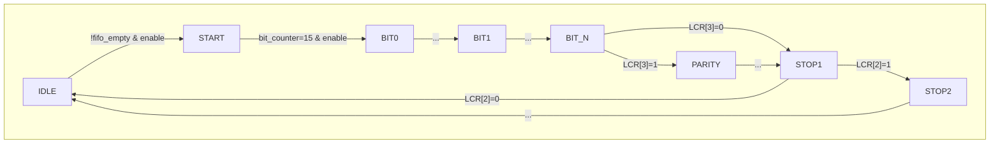

# UART TX 模块微架构设计文档 (增强版)

## 1. 模块设计目标与规格

### 1.1. 核心功能
本模块 (`Uart_tx`) 旨在实现一个功能完备的通用异步收发器（UART）的发送部分。其核心任务是将内部总线上的并行数据（8位）转换为标准的串行数据帧，并通过单根 `TXD` 数据线发送出去。为提高数据吞吐率和系统灵活性，模块内部集成了一个16字节深的FIFO缓冲器。

### 1.2. 关键特性
- **协议兼容性**: 完全兼容标准UART协议，包括起始位、可配置数据位、可配置奇偶校验位和可配置停止位。
- **数据缓冲**: 内置16x8-bit的同步FIFO，允许CPU或上游模块在UART发送忙碌时预先写入数据，防止阻塞。
- **高度可配置性**: 通过8位的线控制寄存器（LCR），可动态配置数据帧格式：
    - **数据位宽**: 5, 6, 7, 或 8 位。
    - **停止位**: 1, 1.5, 或 2 位。
    - **奇偶校验**: 支持奇校验、偶校验、固定高/低电平校验或无校验。
- **状态指示**: 提供 `busy`, `tx_fifo_full`, `tx_fifo_empty` 等状态信号，便于外部系统进行状态监控和流控。
- **时钟与复位**: 单一同步时钟域，支持低电平有效的异步复位。

### 1.3. 性能与约束
- **时钟域**: 所有逻辑均同步于输入时钟 `PCLK` 的上升沿。
- **波特率生成**: 采用固定分频方式，每个串行位的发送周期为16个 `PCLK` 时钟周期。波特率 = `PCLK` / 16。
- **FIFO**: 深度为16，位宽为8。

## 2. 整体架构与模块划分

该设计在逻辑上由两个核心子模块构成：`Uart_tx_fifo` 和 `Uart_tx` 的主状态机（FSM）。

```text
+-----------------------------------------------------------------+
| Uart_tx (Top Module)                                            |
|                                                                 |
|  +-----------------------+         +--------------------------+ |
|  |                       | pop     |                          | |
|  |    Uart_tx_fifo       |<--------|      TX Control FSM      | |
|  | (16x8-bit FIFO Buffer)|         |    (State Machine &      | |
|  |                       | data_out|      Baud Generator)     | |
|  | - ip_count, op_count  |-------->|                          | |
|  | - count register      |         | - tx_state register      | |
|  | - data_fifo[15:0]     |         | - bit_counter register   | |
|  |                       |         | - tx_buffer register     | |
|  +-----------------------+         +--------------------------+ |
|      ^      |      |                     |            |         |
|      |      |      |                     |            |         |
| PWDATA,push | full,empty,count           |           TXD, busy  |
|             |                            |                      |
+-------------|----------------------------|----------------------+
              |                            |
          外部总线接口                  串行输出接口
```

- **`Uart_tx_fifo`**: 作为一个独立的FIFO缓冲器，负责数据的存储和管理。它接收外部写入的数据 `PWDATA`，并根据 `Uart_tx` 主FSM的请求，通过 `pop` 信号提供数据。
- **`TX Control FSM`**: 这是模块的控制核心。它负责从FIFO中取出数据，驱动状态机按照UART协议逐位生成串行数据，并控制 `bit_counter` 来精确地划分每个位的发送时间。

## 3. 接口信号详细规范

| 信号名称      | 位宽 | 方向 | 描述 |
|---------------|:----:|:----:|:---|
| `PCLK`        | 1    | 输入 | **系统主时钟**。所有时序逻辑都在此时钟的上升沿触发。 |
| `PRESETn`     | 1    | 输入 | **低电平有效异步复位**。当为0时，模块所有状态和寄存器被强制初始化。 |
| `PWDATA`      | 8    | 输入 | **并行输入数据**。在 `tx_fifo_push` 为高时，此数据被写入FIFO。 |
| `tx_fifo_push`| 1    | 输入 | **FIFO写入使能**。高电平有效，持续一个时钟周期，将 `PWDATA` 写入FIFO。 |
| `LCR`         | 8    | 输入 | **线控制寄存器**。用于配置数据帧格式，具体定义见4.3节。 |
| `enable`      | 1    | 输入 | **发送过程使能**。高电平有效。当为低时，`bit_counter` 停止计数，发送过程暂停。 |
| `tx_fifo_empty`| 1   | 输出 | **FIFO空标志**。高电平表示FIFO中没有任何数据。 |
| `tx_fifo_full`| 1    | 输出 | **FIFO满标志**。高电平表示FIFO已满，无法再写入新数据。 |
| `tx_fifo_count`| 5   | 输出 | **FIFO数据计数**。实时指示FIFO中存储的数据字节数（0-16）。 |
| `busy`        | 1    | 输出 | **发送忙标志**。高电平表示模块正在发送一个数据帧（从START到最后一个STOP位）。 |
| `TXD`         | 1    | 输出 | **串行数据输出线**。空闲时为高电平。 |

## 4. 内部微架构实现细节

### 4.1. `Uart_tx_fifo` 子模块

- **存储结构**: 使用一个16元素的8位寄存器数组 `logic[7:0] data_fifo[15:0]` 作为物理存储。
- **指针管理**:
    - `ip_count` (4-bit): 写指针，指向下一个可写入的位置。
    - `op_count` (4-bit): 读指针，指向下一个要读出的位置。
    - `count` (5-bit): 数据计数器，是判断FIFO空/满的唯一依据，比指针方式更可靠。
- **读写逻辑 (`always @(posedge clk)`)**:
    - **复位**: `count`, `ip_count`, `op_count` 全部清零。
    - **核心控制**: 使用 `case({push, pop})` 语句处理四种情况：
        - `2'b00` (无操作): 状态保持不变。
        - `2'b01` (仅读): 如果 `count > 0`，`count` 减1，`op_count` 加1。
        - `2'b10` (仅写): 如果 `count <= 15`，`count` 加1，`ip_count` 加1，并将 `data_in` 写入 `data_fifo[ip_count]`。
        - `2'b11` (同时读写): `ip_count` 和 `op_count` 都加1，`count` 保持不变。新数据写入 `data_fifo[ip_count]`。
- **输出逻辑 (`always_comb`)**:
    - `data_out = data_fifo[op_count]`: 这是一个**读穿透 (Read-Through)** 设计，读指针 `op_count` 更新后，对应的 `data_out` 在同一个周期内就能立即看到新值。
    - `fifo_empty = ~(|count)`: 使用按位或缩减操作符，当 `count` 所有位都为0时，结果为0，取反后 `fifo_empty` 为1。
    - `fifo_full = (count == 5'b10000)`: 当 `count` 达到16时，`fifo_full` 为1。

### 4.2. `TX Control FSM` 主状态机

这是模块的灵魂，状态转换图如下：



- **状态列表**: `IDLE`, `START`, `BIT0`..`BIT7`, `PARITY`, `STOP1`, `STOP2`。
- **关键寄存器**:
    - `tx_state`: 当前状态机状态。
    - `bit_counter` (4-bit): 位周期计数器。从0计数到15，代表一个位的16个时钟周期。
    - `tx_buffer` (8-bit): 从FIFO取出的待发送数据字节的锁存器。
- **状态详解**:
    - **`IDLE`**: 模块空闲状态。`TXD`保持高电平，`busy`为低。在此状态下，持续检测 `tx_fifo_empty`。一旦FIFO非空且 `enable` 为高，它会执行两个关键操作：
        1.  `pop_tx_fifo <= 1`: 拉高 `pop` 信号一拍，请求FIFO提供数据。
        2.  `tx_buffer <= tx_fifo_out`: 在**下一个时钟沿**锁存从FIFO输出的数据。
        同时，置位 `busy` 并跳转到 `START` 状态。
    - **`START`**: 发送起始位。`TXD`被拉低为0。`bit_counter` 开始计数，计满16个周期后跳转到 `BIT0`。
    - **`BIT0`..`BIT7`**: 依次发送数据位，从最低位（LSB）开始。`TXD <= tx_buffer[0]`，`TXD <= tx_buffer[1]`... 状态跳转逻辑会根据 `LCR` 配置的数据位宽提前结束。例如，如果配置为5位数据，在 `BIT4` 状态结束后就会直接跳转到 `PARITY` 或 `STOP1`。
    - **`PARITY`**: 如果 `LCR[3]` (奇偶校验使能) 为1，则进入此状态。根据 `LCR[5:4]` 的配置计算并发送校验位。
    - **`STOP1`, `STOP2`**: 发送停止位。`TXD`被置为高电平1。`STOP1`是必须的。如果 `LCR[2]` (停止位配置) 为1，则在 `STOP1` 之后会额外进入 `STOP2` 状态，以发送1.5或2个停止位。完成后，状态机返回 `IDLE`。

### 4.3. `LCR` 配置逻辑详解

`LCR` 寄存器在状态机跳转时被动态解析，决定了数据帧的实时格式。

| LCR 位   | 功能         | 值      | 描述                               |
|:---------|:-------------|:--------|:-----------------------------------|
| `[1:0]`  | 数据位宽     | `2'b00` | 5 bits                             |
|          |              | `2'b01` | 6 bits                             |
|          |              | `2'b10` | 7 bits                             |
|          |              | `2'b11` | 8 bits                             |
| `[2]`    | 停止位       | `0`     | 1 stop bit                         |
|          |              | `1`     | 1.5 or 2 stop bits (进入`STOP2`状态) |
| `[3]`    | 奇偶校验使能 | `0`     | Parity Disabled                    |
|          |              | `1`     | Parity Enabled (进入`PARITY`状态)  |
| `[5:4]`  | 奇偶校验类型 | `2'b00` | Even Parity (偶校验)               |
|          | (当`[3]`=1时) | `2'b01` | Odd Parity (奇校验)                |
|          |              | `2'b10` | Stick Parity '1' (固定为1)         |
|          |              | `2'b11` | Stick Parity '0' (固定为0)         |

**一个值得注意的实现细节**: 在数据位发送结束时（例如 `BIT4` 状态），代码中有 `tx_buffer[7:5] <= 0;` 这样的语句。这是为了在计算奇偶校验之前，将 `tx_buffer` 中未使用的更高位置零，确保它们不影响校验位的计算结果（`^tx_buffer`）。这是一个非常严谨和健壮的设计。

## 5. 时序与波形示例

### 5.1. FIFO写入时序

```wavedrom
{ signal: [
  { name: 'PCLK',         wave: 'p...........' },
  { name: 'tx_fifo_push', wave: '0.1.0.......' },
  { name: 'PWDATA',       wave: 'x.3.x.......', data: ['0xAA'] },
  { name: 'tx_fifo_full', wave: '0...........' },
  { name: 'tx_fifo_count',wave: '2.3.2.......', data: ['N', 'N+1'] },
]}
```
当 `tx_fifo_push` 在时钟上升沿被采样为高时，`PWDATA` 的值在下一个时钟周期被写入FIFO，同时 `tx_fifo_count` 增加。

### 5.2. 完整发送流程 (8-N-1)

```wavedrom
{ signal: [
  { name: 'PCLK',          wave: 'p....................................' },
  { name: 'tx_state',      wave: '2.3.4...................5.2........', data: ['IDLE', 'START', 'BIT0', 'STOP1', 'IDLE'] },
  { name: 'tx_fifo_empty', wave: '1.0................................' },
  { name: 'enable',        wave: '1..................................' },
  { name: 'pop_tx_fifo',   wave: '0.1.0..............................' },
  { name: 'busy',          wave: '0.1..............................0.' },
  { name: 'TXD',           wave: '1.0.2...2...2...2...2...2...2...2.1..', data: ['Start', 'D0', 'D1', 'D2', 'D3', 'D4', 'D5', 'D6', 'D7', 'Stop'] },
]}
```
1.  在 `IDLE` 状态，检测到 `tx_fifo_empty` 变低且 `enable` 为高。
2.  下一个周期，`pop_tx_fifo` 拉高一拍，`busy` 变高，状态切换到 `START`。
3.  `TXD` 输出起始位0，持续16个时钟周期。
4.  随后依次输出8个数据位 `D0` 到 `D7`，每个位持续16个周期。
5.  最后输出停止位1，持续16个周期。
6.  发送结束后，状态返回 `IDLE`，`busy` 信号拉低。

## 6. 待验证点与设计思考
- **并发读写FIFO**: 验证在 `push` 和 `pop` 同时有效时，FIFO的行为是否正确（数据正确传递，`count` 不变）。
- **LCR动态切换**: 在一次发送过程中（`busy`为高），改变 `LCR` 的值。当前设计会在当前帧发送完毕后，下一帧开始时采用新的 `LCR` 值。需要验证此行为是否符合预期。
- **`enable` 信号**: 验证在发送过程中（例如 `BIT3` 状态），将 `enable` 拉低，`bit_counter` 是否停止计数，`TXD` 电平是否保持不变。再次拉高 `enable` 后，发送是否能从暂停处继续。
- **边界条件**:
    - FIFO满时继续 `push`，数据是否被丢弃，`count` 是否保持不变。
    - FIFO空时 `pop`（虽然FSM设计上避免了这种情况），FIFO指针和 `count` 是否保持不变。
- **复位**: 验证在发送过程中任意时刻，异步复位 `PRESETn` 是否能将所有状态正确初始化，`TXD` 是否恢复到高电平。